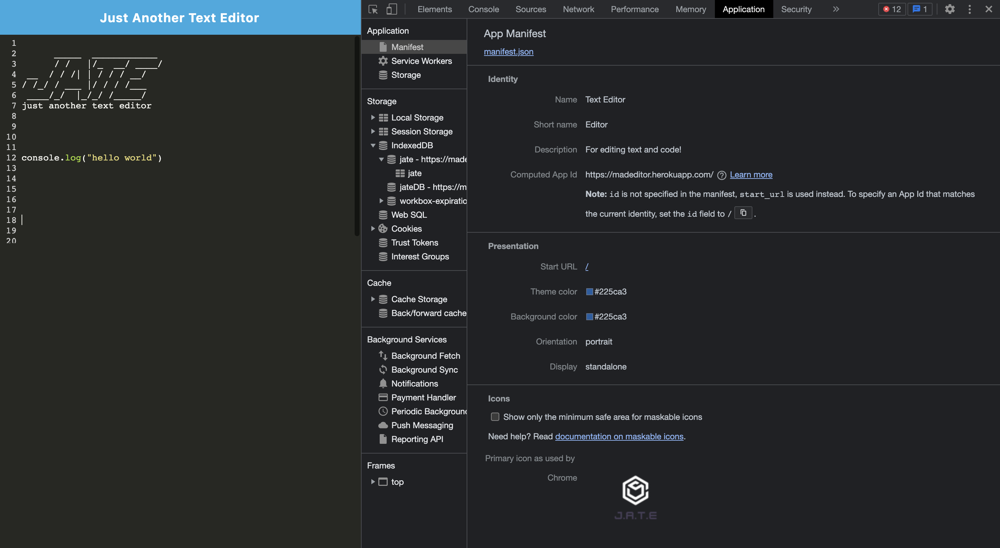
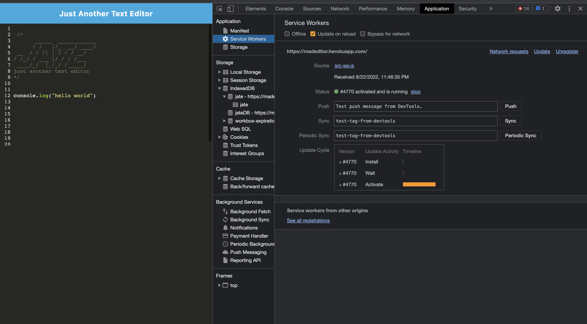
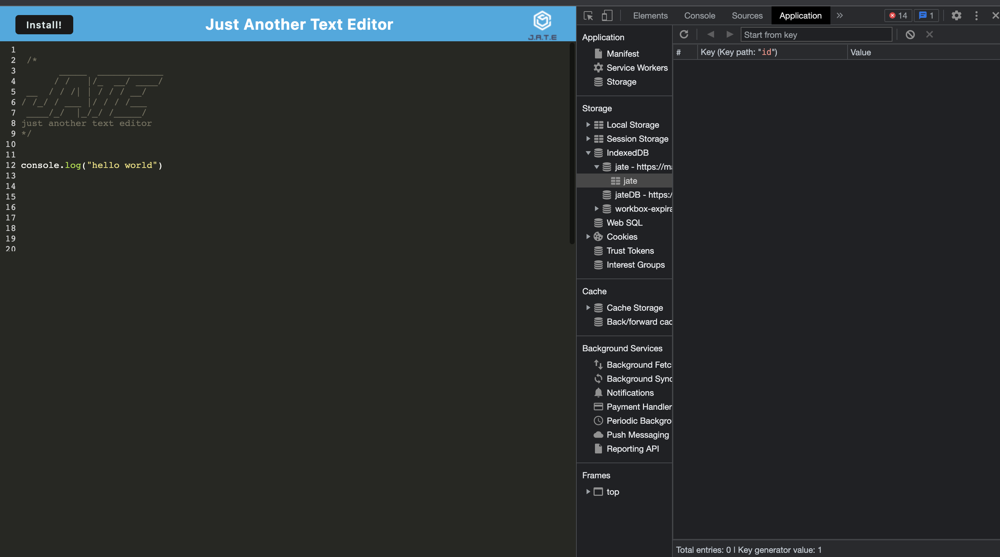

# pwa-text-editor

[](https://opensource.org/licenses/MIT)

This app is a text editor that runs in the browser. It's a single-page application that meets the PWA criteria. The application also functions offline.

## Heroku Deployed link and Github URL 

- GitHub URL : https://github.com/priyarizal/pwa-text-editor

- Heroku deployed link: https://madeditor.herokuapp.com/

## Installation
To install dependencies needed, please run the following command:

```
npm i
```
If rebuild is necessary, run the following command:

```
npm run start:dev || npm run start
```
## Code Snippets
 - Manifest file

 ```
 // Creates a manifest file 
      new WebpackPwaManifest({
        fingerprints: false,
        inject: true,
        name: 'Text Editor',
        short_name: 'Editor',
        description: 'For editing text and code!',
        background_color: '#225ca3',
        theme_color: '#225ca3',
        start_url: '/',
        publicPath: '/',
        icons: [
          {
            src: path.resolve('src/images/logo.png'),
            sizes: [96, 128, 192, 256, 384, 512],
            destination: path.join('assets', 'icons'),
          },
        ],
      }),
    ],

 ```
 - plugins
 ```
 plugins: [
      // this is a webpack plugin that generates our html file and injects the bundles.
      new HtmlWebpackPlugin({
        title: 'Text Editor',
        template: './index.html',
      }),
      // Injects custom service worker
      new InjectManifest({
        swSrc: './src-sw.js',
        swDest: 'src-sw.js',
      }),
```

Adding logic to a method that accepts some content and adds it to the database
```
export const putDb = async (content) => {
  console.log('PUT to the database');
  const jateDb = await openDB('jateDB', 1);
  const jatetext = jateDb.transaction('jate', 'readwrite');
  const store = jatetext.objectStore('jate');
  const request = store.put({ data: content });
  const result = await request;
  console.log('🚀 - data saved to the database', result);
};
```
## Technologies Used
- JavaScript
- Node.js
- NPM
- Express.js
- Webpack
- Babel

## App Demo


## Screenshots




## License
MIT

## Questions
If you have any questions about the project, please feel free to reach me at priya.rizal2@gmail.com